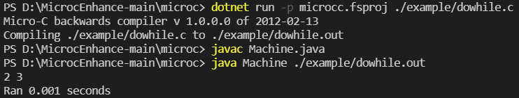

[2020-2021学年第2学期]

# [**实 验 报 告**]


- 课程名称:编程语言原理与编译
- 实验项目:期末大作业
- 专业班级__计算机1802_
- 学生学号_31801113_ 31801111_
- 学生姓名 蔡晓辰  周云奖
- 实验指导教师:郭鸣

| 姓名   | 学号     | 班级       | 任务                                                         | 权重 |
| ------ | -------- | ---------- | ------------------------------------------------------------ | ---- |
| 蔡晓辰   | 31801113 | 计算机1803 | 解释器（主要）、编译器（一部分）、Java虚拟机（主要）、测试、文档 | 0.95  |
| 周云奖 | 31801111 | 计算机1802 | 编译器（主要）、测试、文档、注释                             | 0.95  |

成员提交日志

1. 项目自评等级:(1-5) 请根据自己项目情况填写下表

   （完善程度：个人认为实现的完善程度，个人花费的工作量等
   	难度：实现的困难程度，工作量大小，老师定义的困难程度等

| 解释器                   | 完善程度 | 难度 | 备注                           |
| ------------------------ | -------- | ---- | ------------------------------ |
| 字符类型                 | 5        | 1    |                                |
| dowhile循环              | 5        | 1    |                                |
| float类型                | 5        | 2    |                                |
| for循环                  | 5        | 2    |                                |

| 编译器                | 完善程度 | 难度 | 备注                                |
| --------------------- | -------- | ---- | ----------------------------------- |
| 各类数组，数组检查    | 5        | 3    | 判定调用是否越界                    |
| 字符类型              | 5        | 1    |                                     |
| dowhile循环           | 5        | 1    |                                     |
| float类型             | 5        | 1    |                                     |
| for循环               | 5        | 3    |                                     |

1. 项目说明

   - 整体文件架构

     src文件夹               Java虚拟机

     TestInterp文件夹  解释器测试集

     TestParse文件夹   编译器测试集

     Absyn.fs                 抽象语法

     CLex.fsl          		fslex词法定义

     CPar.fsy             	fsyacc语法定义

     Parse.fs                 语法解析器

     Interp.fs                 解释器

     interpc.fsproj        项目文件

     Contcomp.fs         编译器

     Machine.fs            指令定义

     microcc.fsproj      编译器项目文件

   - 项目运行

     **解释器：**

     dotnet restore interpc.fsproj //可选

     dotnet clean interpc.fsproj  //可选

     dotnet build -v n interpc.fsproj //构建，-v n查看详细生成过程

     ./bin/Debug/net5.0/interpc.exe  测试的文件 参数

     dotnet run -p interpc.fsproj 测试的文件 参数

     dotnet run -p interpc.fsproj -g 测试的文件 参数 //显示token AST 等调试信息  

     **编译器：**

     dotnet restore microcc.fsproj

     dotnet clean microcc.fsproj

     dotnet build microcc.fsproj //构建编译器

     dotnet run -p microcc.fsproj 测试的文件 //执行编译器

     ./bin/Debug/net5.0/microcc.exe 测试的文件 //直接执行

     **Java虚拟机：**

     javac Machine.java

     java Machine 测试的文件（.out)  参数 

     java Machinetrace 测试的文件 参数 //可以查看栈

2. 运行示例
   
   dowhile的实现
   
   使用示例

   ```C
   void main()
    {
	    int a;
	    a = 1;
	    do { a = a + 1;
	    print a; 
	    }
	    while (a < 3)
    } 
   ```

   
   
   

   float的实现

   使用示例

   ```C
   void main()
    {
	    float a;
	    a = 2.2;
	    int b;
	    b = 3;
	    float c;
	    c = a + b;
	    print(c);
    } 
   ```

   

   char的实现

   使用示例

   ```C
   void main() {
        char a;
        a = 'a';
        print a;
    }
   ```

   

3. 心得体会
   
   这次的编译原理大作业让我感到非常的沮丧，我不知道在我的能力范围中有什么能够做出来，同时我也深深地感受到自己的能力有待提高。F#是我在这次课上第一次遇到的函数式编程语言，函数式编程语言也与以前学到的课程非常不一样，我很难读懂所给的代码代表着什么意思，各种递归和嵌套令我觉得无从下手。尽管老师已经给了很多的阅读材料，但这并没有太多实质性的帮助，很多的习题老师在布置完后并不进行解答，教材和PPT上的案例有时并不是最典型的，对于特殊情况的说明补充非常的少。整个学期的课让我觉得进程过快，难度过高，与教相同课程的另一位老师相比，我认为另一位老师在某些重要课程上放慢脚步仔细讲解并放弃最后几节提高课的内容的行为是非常明智的。想读懂代码是第一道坎，想熟练使用语言是第二道坎，想将项目进行修改是第三道坎，我认为我的能力不足以支持我在一个短短的学期内完成对于这三道坎的翻越。我希望老师能降低此课程的难度，并加大对于基础的讲解。